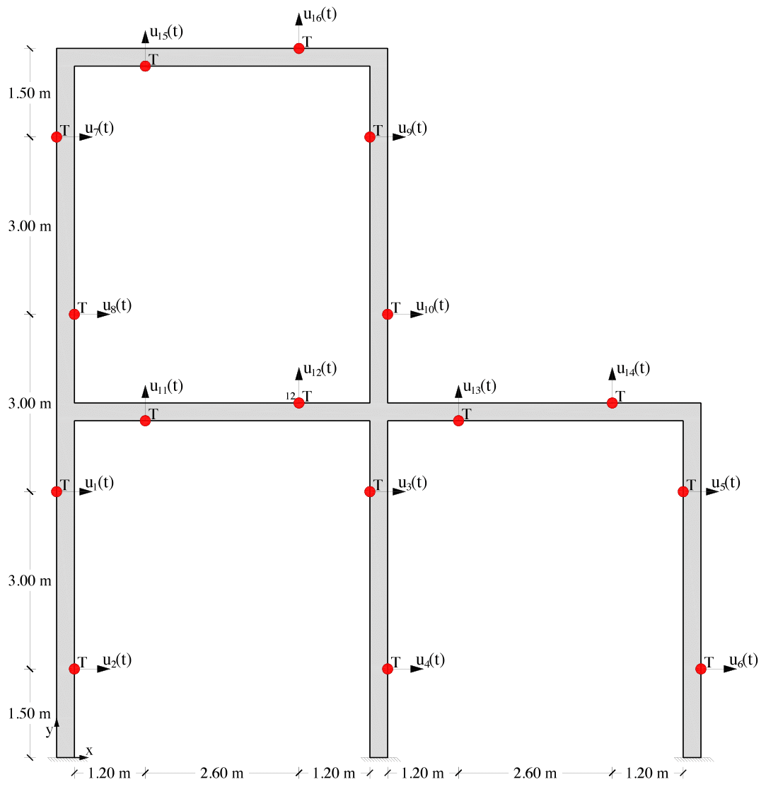

# **structural_health_monitoring**


This repository contains source code of a work conducted in the structural health monitoring domain.

## **Abstract**
Structural Health Monitoring (SHM) of civil structures using IoT sensors is a major emerging challenge. SHM aims to detect and identify any deviation from a reference condition, typically a damage-free baseline, to keep track of the relevant structural integrity. Machine Learning (ML) techniques have recently been employed to empower vibration-based SHM systems. Supervised ML tends to achieve better accuracy than unsupervised ML, but it requires human intervention to label data appropriately. However, labelled data related to damage conditions of civil structures are often unavailable. To overcome this limitation, a key solution is a digital twin relying on physics-based numerical models to simulate the structural response in terms of the vibration recordings provided by IoT devices during the events of interest, such as wind or seismic excitations. This paper presents such comprehensive approach, here framed to address the tasks of damage localization, exploiting a Convolutional Neural Network (CNN). Early experimental results relevant to a pilot application involving a sample structure, show the potential of the proposed approach, as well as the reusability of the trained system in presence of varying loading scenarios.

&nbsp;

## **Scenario** 
All methods proposed in this repo refer to the following scenario shown on the figure below: 2D frame of a two-floor building. 16 sensors are installed at different locations to monitor both the X and Y axis. The red circles mark the exact points of the sensor positioning, in each point are placed both a *displacement sensor* and an *accelerometer*.



&nbsp;

## **Project structure**
The project is composed by the following files and folders:
* **data** is the folder where you have to put the data in npy format. 
* **models** is the folder where you can save the models you train.
* **autoencoderds.ipynb** is a colab notebook containing the definition of three different types of autoencoder architectures: *Feedforward AE*, *Convolutional AE* and *Long Short Time Memory AE*. Each of these architectures is trained twice: the first time on uncorrupted data to have a benchmark, the second time on data where a low power and lossy network is simulated to evaluate the performance degradation in this other scenario.
* **convolutional_models.ipynb** is a colab notebook containing the definition of the convolutional architectures of the different classifiers and regressors and the training of them on both clean and corrupted data
* **testing_models.ipynb** is a colab notebook where we evaluate how models built in *convolutional_models.ipynb* perform when distortion levels vary
* **utils.ipynb** is a colab notebook that contains some utility methods. It is run at the beginning of every other colab notebook.

```
wget http://131.114.50.176/owncloud/s/TZ1G53X18PevT1b/download -O dataset.zip

 TODO
unzip
cp
```

